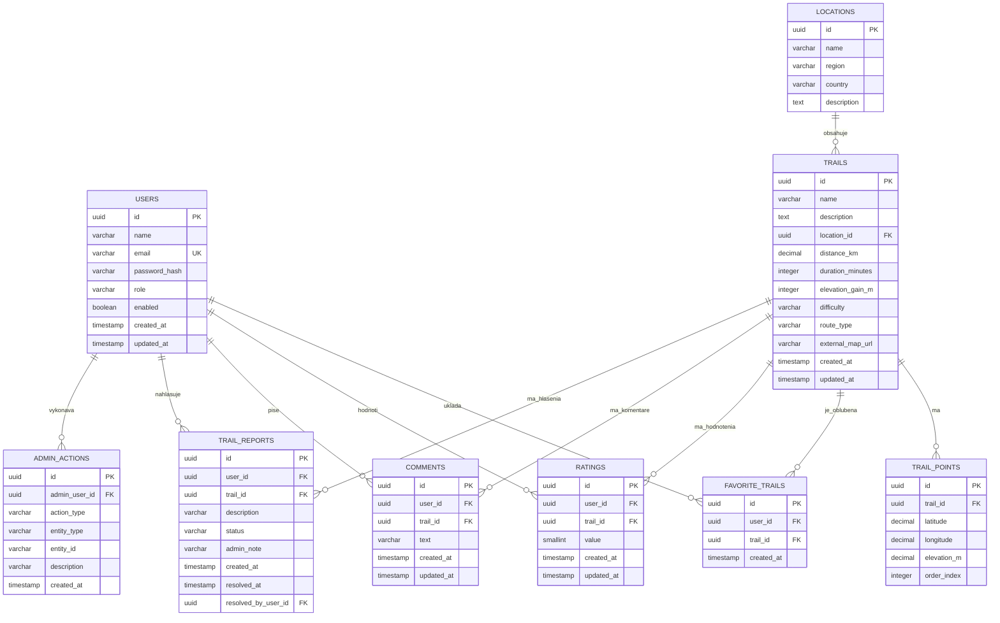

# Database Design – TrailPlanner

## 1. Účel dokumentu

Tento dokument opisuje návrh relačnej databázy aplikácie TrailPlanner.

Jeho cieľom je definovať:

* databázové tabuľky,
* atribúty jednotlivých tabuliek,
* primárne a cudzie kľúče,
* vzťahy medzi tabuľkami,
* databázové obmedzenia,
* základné pravidlá konzistencie údajov.

Návrh vychádza zo Software Requirements Specification, prípadov použitia, doménového modelu a architektúry projektu.

Databázový návrh je vytvorený pre MVP verziu aplikácie, pričom počíta s možnosťou budúceho rozšírenia.

---

## 2. Typ databázy

TrailPlanner bude používať relačnú databázu.

Relačný databázový model je vhodný najmä preto, že systém obsahuje:

* jednoznačne definované entity,
* vzťahy medzi používateľmi a trasami,
* väzby medzi trasami, lokalitami a GPS bodmi,
* požiadavky na jedinečnosť údajov,
* potrebu transakčného spracovania.

Konkrétny databázový systém bude vybraný v rámci technologických rozhodnutí projektu. Predpokladá sa použitie databázy PostgreSQL alebo inej relačnej databázy podporovanej frameworkom Spring Boot.

---

## 3. Prehľad tabuliek

Databáza MVP bude obsahovať nasledujúce hlavné tabuľky:

| Tabuľka           | Účel                                                       |
| ----------------- | ---------------------------------------------------------- |
| `users`           | Uchováva používateľské účty                                |
| `locations`       | Uchováva geografické oblasti trás                          |
| `trails`          | Uchováva základné údaje o turistických trasách             |
| `trail_points`    | Uchováva usporiadané GPS body trás                         |
| `favorite_trails` | Uchováva obľúbené trasy používateľov                       |
| `ratings`         | Uchováva hodnotenia trás                                   |
| `comments`        | Uchováva komentáre používateľov                            |
| `trail_reports`   | Uchováva nahlásené chyby alebo problémy trás               |
| `admin_actions`   | Uchováva záznamy o vybraných administrátorských operáciách |

Niektoré tabuľky môžu byť počas implementácie zjednodušené alebo presunuté do neskoršej verzie projektu.

---

# 4. Tabuľka `users`

Tabuľka uchováva používateľské účty.

## Atribúty

| Stĺpec          | Typ           | Povinný | Obmedzenie       | Popis                               |
| --------------- | ------------- | ------- | ---------------- | ----------------------------------- |
| `id`            | UUID / BIGINT | áno     | PRIMARY KEY      | Jedinečný identifikátor používateľa |
| `name`          | VARCHAR(100)  | áno     | NOT NULL         | Zobrazované meno používateľa        |
| `email`         | VARCHAR(255)  | áno     | NOT NULL, UNIQUE | Prihlasovací e-mail                 |
| `password_hash` | VARCHAR(255)  | áno     | NOT NULL         | Hash hesla                          |
| `role`          | VARCHAR(20)   | áno     | NOT NULL         | Rola používateľa                    |
| `enabled`       | BOOLEAN       | áno     | DEFAULT TRUE     | Stav používateľského účtu           |
| `created_at`    | TIMESTAMP     | áno     | NOT NULL         | Čas vytvorenia účtu                 |
| `updated_at`    | TIMESTAMP     | áno     | NOT NULL         | Čas poslednej zmeny                 |

## Povolené hodnoty `role`

```text
USER
ADMIN
```

## Pravidlá

* E-mail musí byť jedinečný.
* E-mail sa má pred uložením normalizovať, napríklad previesť na malé písmená.
* Heslo sa nesmie ukladať v otvorenom tvare.
* Verejnou registráciou môže vzniknúť iba používateľ s rolou `USER`.
* Zakázaný účet sa nemôže prihlásiť.

---

# 5. Tabuľka `locations`

Tabuľka uchováva geografické oblasti, do ktorých patria turistické trasy.

Lokalita predstavuje región, pohorie alebo inú pomenovanú oblasť. Nepredstavuje presný priebeh trasy.

## Atribúty

| Stĺpec        | Typ           | Povinný | Obmedzenie  | Popis                            |
| ------------- | ------------- | ------- | ----------- | -------------------------------- |
| `id`          | UUID / BIGINT | áno     | PRIMARY KEY | Jedinečný identifikátor lokality |
| `name`        | VARCHAR(150)  | áno     | NOT NULL    | Názov lokality                   |
| `region`      | VARCHAR(150)  | nie     |             | Región alebo kraj                |
| `country`     | VARCHAR(100)  | áno     | NOT NULL    | Krajina                          |
| `description` | TEXT          | nie     |             | Stručný opis lokality            |

## Pravidlá

* Jedna lokalita môže obsahovať viac trás.
* Každá trasa patrí práve do jednej lokality.
* Lokalita neuchováva GPS priebeh konkrétnej trasy.

## Odporúčané obmedzenie

```text
UNIQUE (name, region, country)
```

Toto obmedzenie zabraňuje vytvoreniu rovnakej lokality viackrát.

---

# 6. Tabuľka `trails`

Tabuľka uchováva základné informácie o turistických trasách.

## Atribúty

| Stĺpec             | Typ           | Povinný | Obmedzenie  | Popis                          |
| ------------------ | ------------- | ------- | ----------- | ------------------------------ |
| `id`               | UUID / BIGINT | áno     | PRIMARY KEY | Jedinečný identifikátor trasy  |
| `name`             | VARCHAR(200)  | áno     | NOT NULL    | Názov trasy                    |
| `description`      | TEXT          | áno     | NOT NULL    | Podrobný opis trasy            |
| `location_id`      | UUID / BIGINT | áno     | FOREIGN KEY | Lokalita trasy                 |
| `distance_km`      | DECIMAL(6,2)  | áno     | CHECK > 0   | Dĺžka trasy v kilometroch      |
| `duration_minutes` | INTEGER       | áno     | CHECK > 0   | Odhadované trvanie v minútach  |
| `elevation_gain_m` | INTEGER       | áno     | CHECK >= 0  | Celkové stúpanie v metroch     |
| `difficulty`       | VARCHAR(20)   | áno     | NOT NULL    | Náročnosť trasy                |
| `route_type`       | VARCHAR(30)   | nie     |             | Typ trasy                      |
| `external_map_url` | VARCHAR(500)  | nie     |             | Odkaz na externú mapovú službu |
| `created_at`       | TIMESTAMP     | áno     | NOT NULL    | Čas vytvorenia                 |
| `updated_at`       | TIMESTAMP     | áno     | NOT NULL    | Čas poslednej zmeny            |

## Povolené hodnoty `difficulty`

```text
EASY
MEDIUM
HARD
```

Presné názvy a počet úrovní náročnosti sa môžu ešte upraviť.

## Povolené hodnoty `route_type`

```text
LOOP
OUT_AND_BACK
POINT_TO_POINT
```

## Pravidlá

* Každá trasa patrí práve do jednej lokality.
* Dĺžka trasy musí byť väčšia ako nula.
* Trvanie musí byť väčšie ako nula.
* Prevýšenie nesmie byť záporné.
* Priemerné hodnotenie sa nebude ukladať priamo v tabuľke `trails`.
* Priemer sa vypočíta z aktuálnych záznamov v tabuľke `ratings`.
* Presný GPS priebeh trasy sa uchováva v tabuľke `trail_points`.

## Cudzí kľúč

```text
location_id → locations.id
```

## Odporúčané indexy

```text
INDEX ON trails(location_id)
INDEX ON trails(difficulty)
INDEX ON trails(route_type)
INDEX ON trails(distance_km)
```

Tieto indexy môžu urýchliť vyhľadávanie trás podľa filtrov.

---

# 7. Tabuľka `trail_points`

Tabuľka uchováva GPS body určujúce priebeh turistickej trasy.

Body sú usporiadané pomocou atribútu `order_index`.

## Atribúty

| Stĺpec        | Typ           | Povinný | Obmedzenie  | Popis                        |
| ------------- | ------------- | ------- | ----------- | ---------------------------- |
| `id`          | UUID / BIGINT | áno     | PRIMARY KEY | Jedinečný identifikátor bodu |
| `trail_id`    | UUID / BIGINT | áno     | FOREIGN KEY | Trasa, ku ktorej bod patrí   |
| `latitude`    | DECIMAL(9,6)  | áno     | CHECK       | Zemepisná šírka              |
| `longitude`   | DECIMAL(9,6)  | áno     | CHECK       | Zemepisná dĺžka              |
| `elevation_m` | DECIMAL(7,2)  | nie     |             | Nadmorská výška              |
| `order_index` | INTEGER       | áno     | CHECK >= 0  | Poradie bodu na trase        |

## Pravidlá

* Jeden GPS bod patrí práve jednej trase.
* Jedna trasa môže obsahovať viac GPS bodov.
* Poradie bodov v rámci jednej trasy musí byť jedinečné.
* Hodnota `latitude` musí byť v rozsahu od `-90` do `90`.
* Hodnota `longitude` musí byť v rozsahu od `-180` do `180`.
* Začiatočný bod je bod s najnižšou hodnotou `order_index`.
* Koncový bod je bod s najvyššou hodnotou `order_index`.

## Cudzí kľúč

```text
trail_id → trails.id
```

## Obmedzenia

```text
UNIQUE (trail_id, order_index)

CHECK (latitude >= -90 AND latitude <= 90)

CHECK (longitude >= -180 AND longitude <= 180)

CHECK (order_index >= 0)
```

## Poznámka pre MVP

GPS body budú v databáze pripravené, ale interaktívne zobrazenie priebehu trasy na mape nemusí byť súčasťou MVP.

Pri prvotných dátach môže mať trasa iba začiatočný a koncový bod. Podrobnejšia geometria sa môže doplniť v budúcnosti.

---

# 8. Tabuľka `favorite_trails`

Tabuľka predstavuje väzbu medzi používateľom a jeho obľúbenou trasou.

Ide o asociatívnu tabuľku pre vzťah M:N medzi používateľmi a trasami.

## Atribúty

| Stĺpec       | Typ           | Povinný | Obmedzenie  | Popis                         |
| ------------ | ------------- | ------- | ----------- | ----------------------------- |
| `id`         | UUID / BIGINT | áno     | PRIMARY KEY | Jedinečný identifikátor väzby |
| `user_id`    | UUID / BIGINT | áno     | FOREIGN KEY | Používateľ                    |
| `trail_id`   | UUID / BIGINT | áno     | FOREIGN KEY | Obľúbená trasa                |
| `created_at` | TIMESTAMP     | áno     | NOT NULL    | Čas pridania medzi obľúbené   |

## Pravidlá

* Používateľ môže mať viac obľúbených trás.
* Trasa môže byť obľúbená u viacerých používateľov.
* Rovnaká trasa môže byť u jedného používateľa uložená iba raz.

## Cudzie kľúče

```text
user_id → users.id

trail_id → trails.id
```

## Obmedzenie

```text
UNIQUE (user_id, trail_id)
```

---

# 9. Tabuľka `ratings`

Tabuľka uchováva hodnotenia trás používateľmi.

## Atribúty

| Stĺpec       | Typ           | Povinný | Obmedzenie  | Popis                              |
| ------------ | ------------- | ------- | ----------- | ---------------------------------- |
| `id`         | UUID / BIGINT | áno     | PRIMARY KEY | Jedinečný identifikátor hodnotenia |
| `user_id`    | UUID / BIGINT | áno     | FOREIGN KEY | Autor hodnotenia                   |
| `trail_id`   | UUID / BIGINT | áno     | FOREIGN KEY | Hodnotená trasa                    |
| `value`      | SMALLINT      | áno     | CHECK 1–5   | Hodnota hodnotenia                 |
| `created_at` | TIMESTAMP     | áno     | NOT NULL    | Čas vytvorenia                     |
| `updated_at` | TIMESTAMP     | áno     | NOT NULL    | Čas poslednej zmeny                |

## Pravidlá

* Hodnotenie musí byť celé číslo od 1 do 5.
* Jeden používateľ môže mať pre jednu trasu iba jedno aktuálne hodnotenie.
* Opätovné hodnotenie tej istej trasy aktualizuje pôvodný záznam.
* Priemerné hodnotenie trasy sa vypočítava z tabuľky `ratings`.

## Cudzie kľúče

```text
user_id → users.id

trail_id → trails.id
```

## Obmedzenia

```text
UNIQUE (user_id, trail_id)

CHECK (value >= 1 AND value <= 5)
```

---

# 10. Tabuľka `comments`

Tabuľka uchováva komentáre používateľov k turistickým trasám.

## Atribúty

| Stĺpec       | Typ           | Povinný | Obmedzenie  | Popis                             |
| ------------ | ------------- | ------- | ----------- | --------------------------------- |
| `id`         | UUID / BIGINT | áno     | PRIMARY KEY | Jedinečný identifikátor komentára |
| `user_id`    | UUID / BIGINT | áno     | FOREIGN KEY | Autor komentára                   |
| `trail_id`   | UUID / BIGINT | áno     | FOREIGN KEY | Komentovaná trasa                 |
| `text`       | VARCHAR(2000) | áno     | NOT NULL    | Text komentára                    |
| `created_at` | TIMESTAMP     | áno     | NOT NULL    | Čas vytvorenia                    |
| `updated_at` | TIMESTAMP     | áno     | NOT NULL    | Čas poslednej úpravy              |

## Pravidlá

* Komentár môže vytvoriť iba prihlásený používateľ.
* Komentár nesmie byť prázdny.
* Používateľ môže k jednej trase pridať viac komentárov.
* Maximálna dĺžka komentára bude obmedzená aplikačnou a databázovou validáciou.

## Cudzie kľúče

```text
user_id → users.id

trail_id → trails.id
```

## Odporúčaný index

```text
INDEX ON comments(trail_id, created_at)
```

Index umožní efektívne zobrazovať komentáre konkrétnej trasy podľa času.

---

# 11. Tabuľka `trail_reports`

Tabuľka uchováva problémy a chyby turistických trás nahlásené používateľmi.

Môže ísť napríklad o:

* nesprávnu vzdialenosť,
* nesprávne prevýšenie,
* chybný opis,
* neaktuálnu priechodnosť,
* nesprávny GPS bod,
* iný problém s údajmi trasy.

## Atribúty

| Stĺpec                | Typ           | Povinný | Obmedzenie  | Popis                                 |
| --------------------- | ------------- | ------- | ----------- | ------------------------------------- |
| `id`                  | UUID / BIGINT | áno     | PRIMARY KEY | Identifikátor hlásenia                |
| `user_id`             | UUID / BIGINT | áno     | FOREIGN KEY | Autor hlásenia                        |
| `trail_id`            | UUID / BIGINT | áno     | FOREIGN KEY | Nahlásená trasa                       |
| `description`         | VARCHAR(2000) | áno     | NOT NULL    | Opis problému                         |
| `status`              | VARCHAR(30)   | áno     | NOT NULL    | Stav spracovania                      |
| `admin_note`          | VARCHAR(2000) | nie     |             | Interná poznámka administrátora       |
| `created_at`          | TIMESTAMP     | áno     | NOT NULL    | Čas vytvorenia hlásenia               |
| `resolved_at`         | TIMESTAMP     | nie     |             | Čas uzavretia hlásenia                |
| `resolved_by_user_id` | UUID / BIGINT | nie     | FOREIGN KEY | Administrátor, ktorý hlásenie uzavrel |

## Povolené hodnoty `status`

```text
OPEN
IN_PROGRESS
RESOLVED
REJECTED
```

## Cudzie kľúče

```text
user_id → users.id

trail_id → trails.id

resolved_by_user_id → users.id
```

## Poznámka

Ak bude nahlasovanie chyby v MVP príliš rozsiahle, tabuľka sa môže presunúť do ďalšej verzie projektu.

---

# 12. Tabuľka `admin_actions`

Tabuľka môže uchovávať základný audit vybraných administrátorských operácií.

Príkladom je vytvorenie, úprava alebo odstránenie trasy alebo zmena stavu používateľského účtu.

## Atribúty

| Stĺpec          | Typ           | Povinný | Obmedzenie  | Popis                 |
| --------------- | ------------- | ------- | ----------- | --------------------- |
| `id`            | UUID / BIGINT | áno     | PRIMARY KEY | Identifikátor záznamu |
| `admin_user_id` | UUID / BIGINT | áno     | FOREIGN KEY | Administrátor         |
| `action_type`   | VARCHAR(50)   | áno     | NOT NULL    | Typ operácie          |
| `entity_type`   | VARCHAR(50)   | áno     | NOT NULL    | Typ zmeneného objektu |
| `entity_id`     | VARCHAR(100)  | nie     |             | Identifikátor objektu |
| `description`   | VARCHAR(1000) | nie     |             | Stručný opis zmeny    |
| `created_at`    | TIMESTAMP     | áno     | NOT NULL    | Čas vykonania         |

## Príklady hodnôt `action_type`

```text
CREATE_TRAIL
UPDATE_TRAIL
DELETE_TRAIL
DISABLE_USER
ENABLE_USER
RESOLVE_REPORT
```

## Cudzí kľúč

```text
admin_user_id → users.id
```

## Poznámka

Táto tabuľka nie je nevyhnutná pre základné fungovanie MVP. Môže byť nahradená technickým logovaním alebo doplnená až v neskoršej verzii.

---

# 13. Vzťahy medzi tabuľkami

## Prehľad kardinalít

| Vzťah                        | Kardinalita |
| ---------------------------- | ----------- |
| `locations` – `trails`       | 1 : N       |
| `trails` – `trail_points`    | 1 : N       |
| `users` – `favorite_trails`  | 1 : N       |
| `trails` – `favorite_trails` | 1 : N       |
| `users` – `ratings`          | 1 : N       |
| `trails` – `ratings`         | 1 : N       |
| `users` – `comments`         | 1 : N       |
| `trails` – `comments`        | 1 : N       |
| `users` – `trail_reports`    | 1 : N       |
| `trails` – `trail_reports`   | 1 : N       |
| `users` – `admin_actions`    | 1 : N       |

Vzťah používateľov a obľúbených trás je logicky M:N, ale v databáze je realizovaný prostredníctvom asociatívnej tabuľky `favorite_trails`.

Rovnako sú prostredníctvom samostatných tabuliek realizované vzťahy používateľov s hodnoteniami a komentármi.

---

# 14. ER diagram



---

# 15. Mazanie údajov

Mazanie údajov musí byť riešené opatrne, aby nedošlo k náhodnej strate súvisiacich údajov.

## Odporúčané správanie

### Vymazanie obľúbenej trasy

Pri odstránení obľúbenej trasy sa odstráni iba záznam z tabuľky `favorite_trails`.

### Vymazanie hodnotenia

Pri odstránení hodnotenia sa odstráni iba príslušný záznam z tabuľky `ratings`.

### Vymazanie komentára

Komentár sa môže fyzicky odstrániť alebo neskôr označiť ako odstránený pomocou soft delete mechanizmu.

### Vymazanie používateľa

V MVP sa odporúča používateľa fyzicky nema­zať. Účet sa deaktivuje nastavením:

```text
enabled = false
```

Tým sa zachovajú komentáre, hodnotenia a ďalšie väzby.

### Vymazanie trasy

Vymazanie trasy musí vyriešiť súvisiace:

* GPS body,
* obľúbené väzby,
* hodnotenia,
* komentáre,
* hlásenia.

Pre MVP je možné zvážiť namiesto fyzického vymazania atribút:

```text
active = false
```

v tabuľke `trails`.

Takáto trasa by sa nezobrazovala vo verejnom vyhľadávaní, ale jej historické údaje by zostali zachované.

---

# 16. Normalizácia databázy

Databázový návrh približne zodpovedá tretej normálnej forme.

Základné princípy:

* každý stĺpec uchováva jednu hodnotu,
* opakujúce sa skupiny údajov sú oddelené do samostatných tabuliek,
* používateľské údaje sa neduplikujú v komentároch ani hodnoteniach,
* lokalita sa neukladá ako text priamo pri každej trase,
* priemerné hodnotenie sa nevkladá priamo do tabuľky `trails`,
* GPS body sú uložené oddelene od základných parametrov trasy.

Takýto návrh znižuje duplicitu údajov a riziko nekonzistentnosti.

---

# 17. Indexovanie

Okrem indexov vytvorených automaticky pre primárne a unikátne kľúče sa odporúčajú indexy najmä pre často filtrované alebo spájané stĺpce.

Odporúčané indexy:

```text
users(email)

trails(location_id)

trails(difficulty)

trails(route_type)

trails(distance_km)

trail_points(trail_id, order_index)

favorite_trails(user_id, created_at)

ratings(trail_id)

comments(trail_id, created_at)

trail_reports(status, created_at)
```

Presné indexy sa môžu upraviť na základe reálnych databázových dotazov.

---

# 18. Budúce rozšírenia

Databázový návrh umožňuje doplniť ďalšie funkcie, napríklad:

* fotografie trás,
* body záujmu,
* uložené používateľské preferencie,
* históriu absolvovaných trás,
* GPX súbory,
* predpoveď počasia,
* používateľské zoznamy trás,
* plánovanie vlastných trás,
* mobilnú aplikáciu,
* pokročilé odporúčanie trás.

Možné budúce tabuľky:

```text
trail_photos
points_of_interest
user_preferences
completed_trails
gpx_files
weather_snapshots
user_trail_lists
```

Tieto tabuľky nie sú súčasťou aktuálneho MVP.

---

# 19. Otvorené rozhodnutia

Pred implementáciou databázy je potrebné potvrdiť:

1. Či sa ako identifikátory použijú `UUID` alebo automaticky generované číselné hodnoty.
2. Či bude náročnosť uložená ako textový enum alebo v samostatnej tabuľke.
3. Či bude typ trasy povinným atribútom.
4. Či má MVP obsahovať tabuľku `trail_reports`.
5. Či má MVP obsahovať tabuľku `admin_actions`.
6. Či bude možné trasu fyzicky vymazať alebo iba deaktivovať.
7. Či bude deaktivácia používateľov súčasťou MVP.
8. Či budú GPS body povinné už pri vytvorení každej trasy.
9. Aká maximálna dĺžka komentára a hlásenia bude povolená.
10. Aký konkrétny databázový systém bude použitý.

---

# 20. Zhrnutie

Navrhnutá databáza oddeľuje hlavné oblasti aplikácie do samostatných tabuliek.

Jadrom systému sú tabuľky:

* `users`,
* `locations`,
* `trails`,
* `trail_points`,
* `favorite_trails`,
* `ratings`,
* `comments`.

Doplnkové oblasti predstavujú:

* `trail_reports`,
* `admin_actions`.

Návrh zabezpečuje:

* konzistenciu údajov,
* minimálnu duplicitu,
* podporu vyhľadávania trás,
* správu používateľských interakcií,
* pripravenosť na budúce mapové funkcie,
* jednoduché mapovanie na backendové entity.

Dokument bude upravený podľa konečného rozsahu MVP a technologických rozhodnutí projektu.
